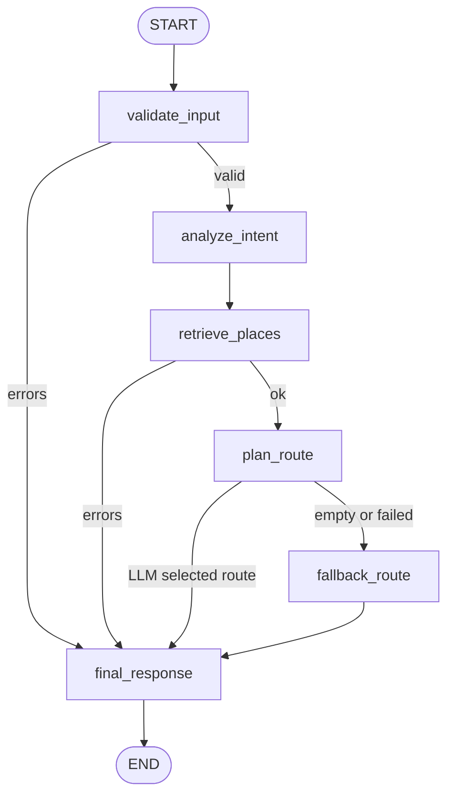

# Cheongju Trip Agent

청주 여행 스타일을 입력하면 관광 API와 카카오 Local API에서 수집한 장소 데이터를 로컬 JSON DB로 저장하고, 그 DB를 기반으로 밥집/카페/놀거리 슬롯형 추천 동선을 생성하는 Flask 앱입니다.

## 코드 구조

모델별 파일을 복붙하지 않도록 공통 기능을 `trip_agent` 패키지로 분리했습니다.

```text
app_gemini.py              # Gemini 실행 진입점, 5001 포트
app.py                     # OpenAI 실행 진입점, 5000 포트
trip_agent/web.py          # Flask 라우트와 app factory
trip_agent/core.py         # LangGraph, Memory, RAG, 추천/동선/대중교통 공통 로직
trip_agent/providers.py    # Gemini/OpenAI 모델 호출부
```

기준 구현은 Gemini입니다. 나중에 모델만 바꾸려면 `MODEL_PROVIDER=gemini|openai` 또는 `trip_agent/providers.py`의 provider 구현만 보면 됩니다. Agent 그래프, RAG, 메모리, ODsay, OutputParser 로직은 `trip_agent/core.py`를 공통으로 사용합니다.

## 장소 데이터 수집

기본 수집 경로는 충청북도 관광명소정보 API입니다. 밥집/카페/숙소 같은 세부 장소는 카카오 Local API 키가 있을 때 함께 수집됩니다.

```powershell
python app.py
```

앱 실행 후 장소 DB를 갱신하려면 다음 엔드포인트를 호출합니다.

```powershell
Invoke-RestMethod -Method Post http://127.0.0.1:5000/api/places/sync
```

수집된 데이터는 `data/cheongju_places.json`에 저장됩니다. 추천 요청 시 이 파일이 없으면 자동으로 수집을 시도합니다.

`data/cheongju_places.json`은 API 응답으로 생성되는 로컬 캐시라 Git에는 올리지 않습니다. GitHub에는 `.env.example`만 올리고, 실제 `.env`와 발급받은 API 키는 커밋하지 마세요.

## 카카오 Local API 사용

카카오 Developers에서 REST API 키를 발급받아 `.env`에 넣습니다.

```powershell
KAKAO_REST_API_KEY=발급받은_REST_API_KEY
```

수집 키워드는 앱 내부에서 다음 유형으로 자동 검색합니다.

- `청주 성안길 맛집`
- `청주 성안길 카페`
- `청주 운리단길 카페`
- `청주 수암골 카페`
- `청주 육거리시장 맛집`
- `청주 청주대 맛집`
- `청주 충북대 맛집`

키 설정 후 서버를 다시 실행하고 `/api/places/sync`를 호출하면 카카오 장소가 로컬 JSON DB에 합쳐집니다.

## AI Agent 동선 생성

`OPENAI_API_KEY`가 설정되어 있으면 추천 요청은 다음 순서로 동작합니다.

1. LangGraph `StateGraph`의 `validate_input` 노드가 입력값, 개인정보, 세션 메모리를 정리합니다.
2. `analyze_intent` 노드가 LangChain `PydanticOutputParser`와 `TravelIntent` 모델로 사용자 의도를 구조화합니다.
3. `retrieve_places` 노드가 로컬 JSON 장소 DB를 LangChain `Document` 형태로 변환하고 Retriever처럼 후보 문서를 검색합니다.
4. `plan_route` 노드가 검색된 후보 문서 Context, 품질, 거리, 예산, 날씨, 카테고리 균형을 LLM에 전달해 동선을 선택합니다.
5. `add_conditional_edges()` 조건 분기로 LLM 선택 실패 시 `fallback_route` 노드가 규칙 기반 추천을 실행합니다.
6. `final_response` 노드가 거리/숙소/최종 문장을 계산하고 `TripPlan` Pydantic 모델로 구조화된 JSON 응답을 검증합니다.

### LangGraph StateGraph

현재 Agent 실행 그래프는 `app.py`의 `build_agent_graph()`에서 구성합니다. `thread_id`는 웹에서 전달하는 `session_id`를 사용하며, LangGraph `MemorySaver`가 설치된 환경에서는 그래프 체크포인터로도 연결됩니다. 아래 다이어그램은 `AGENT_GRAPH.get_graph().draw_mermaid()`로 확인 가능한 구조와 동일한 흐름입니다.



### Memory

웹은 브라우저 `localStorage`에 `session_id`를 저장하고 `/api/recommend` 요청마다 함께 전송합니다. 서버는 `SESSION_STORE`에 최근 6턴의 payload와 summary를 보관합니다. 사용자가 "아까 조건에서 카페만 바꿔줘", "이전 조건 유지하고 비 오는 날로 바꿔줘"처럼 말하면 이전 조건을 기본값으로 이어받고 새 입력만 덮어씁니다.

### RAG

장소 데이터는 `data/cheongju_places.json`의 로컬 DB에서 읽습니다. `retrieve_places` 노드는 후보 장소를 `Document(page_content, metadata)`로 변환한 뒤, 사용자 요청과 태그에 맞게 점수화된 후보를 LLM Context로 넘깁니다. 즉 흐름은 `사용자 요청 → 장소 DB 검색 → Document Context 생성 → LLM 동선 선택`입니다. 현재는 로컬 Retriever 방식이며, 필요하면 같은 `Document` 계층을 Chroma/FAISS VectorStore로 교체할 수 있습니다.

### OutputParser

의도 분석은 `TravelIntent(BaseModel)`, 최종 응답은 `TripPlan(BaseModel)`을 사용합니다. LangChain `PydanticOutputParser`가 설치되어 있으면 parser의 format instruction과 parse 검증을 사용하고, 미설치 환경에서는 같은 Pydantic 모델 검증으로 fallback합니다.

### Gemini 임시 실행

OpenAI 대신 Gemini 모델로 같은 Agent 구조를 실행하려면 `app_gemini.py`를 사용합니다. `app.py`와 `app_gemini.py`는 LangGraph, 메모리, RAG, OutputParser, ODsay 대중교통 로직을 동일하게 유지하고 LLM 호출부만 다릅니다.

```powershell
GEMINI_API_KEY=발급받은_GEMINI_API_KEY
GEMINI_MODEL=gemini-1.5-flash
python app_gemini.py
```

Gemini 앱은 `http://127.0.0.1:5001`에서 실행됩니다. OpenAI 버전 `app.py`는 `http://127.0.0.1:5000`을 사용합니다.

## ODsay 대중교통 안내

대중교통 이동 안내를 표시하려면 `.env`에 ODsay 키를 추가합니다.

```powershell
ODSAY_API_KEY=발급받은_ODSAY_API_KEY
```

`대중교통` 선택 시 도보 약 15분 이내 구간은 도보로 표시하고, 그보다 먼 구간은 ODsay 버스 후보를 최대 4개까지 표시합니다. 당일치기 일정은 버스 이용 구간을 최대 2번까지 사용하고, 같은 좌표 구간은 `data/odsay_transit_cache.json`에 캐시합니다.

## TourAPI 사용

충청북도 API 수집이 실패하거나 TourAPI를 우선 활용하려면 서비스키를 환경변수로 설정합니다.

```powershell
$env:TOUR_API_KEY="발급받은_서비스키"
python app.py
```

청주 시군구 코드가 다르면 아래 값으로 조정할 수 있습니다.

```powershell
$env:TOUR_API_AREA_CODE="33"
$env:TOUR_API_SIGUNGU_CODE="10"
```
